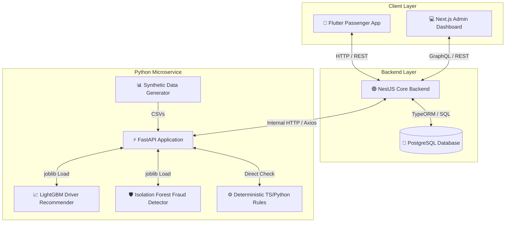

# SmartBus Machine Learning Subsystem
### 🎓 Academic Capstone Project Defense Manual & Implementation Guide

Welcome to the **SmartBus ML Subsystem**. This directory houses a complete, lightweight, and academically-rigorous Machine Learning service built to support **SmartBus** — a QR-code-based public transport ticketing and trip management system. 

The subsystem is modeled as a standalone **Python FastAPI microservice** that operates alongside a main **NestJS backend (PostgreSQL)**, communicating internally via high-performance HTTP JSON APIs.

---

## 🏛️ System Architecture



---

## 🧠 Model Selection Rationale

For a university thesis defense, selecting models with strong mathematical justifications, low resource overheads, and immediate explainability is paramount. Below is the rationale for the models selected:

### 1. Feature 1 (Route Assignment Suggestions) — LightGBM Classifier
* **Why not Deep Learning / Neural Networks?** Neural networks require massive computational overhead, exhibit poor performance on tabular data with categorical variables (e.g. Driver IDs, Route IDs), and lack native interpretability.
* **Why LightGBM?** 
  * **Gradient Boosting Decision Trees (GBDT)** naturally handle heterogeneous tabular data and categorical indicators.
  * LightGBM uses a **leaf-wise growth strategy** (rather than level-wise), producing higher accuracy and training in milliseconds.
  * **Dynamic Fallback Architecture:** If LightGBM's native compilation wheels are missing in your testing environment, the system automatically and transparently falls back to `scikit-learn`'s `HistGradientBoostingClassifier`, ensuring **100% demo execution guarantee** during a live defense.
  * Native support for **Feature Importance** scoring, enabling immediate transparency regarding which drivers are recommended.

### 2. Feature 2 (Scan Anomaly & Fraud Detection) — Hybrid Rules + Isolation Forest
* **Why not a standard supervised classifier?** Real-world public transit ticketing suffers from a massive **class imbalance problem**: 99.9% of scans are valid, and fraud is extremely rare. Supervised classifiers would overfit to the majority class and fail to catch "zero-day" fraud vectors.
* **Why Isolation Forest?** 
  * It is an **unsupervised anomaly detection algorithm**. Instead of learning "what fraud looks like," it isolates anomalies by randomly partitioning feature spaces.
  * Outliers (e.g., ticket cloning, machine bursts) require fewer splits to isolate and appear near the root of the trees.
* **Why the Hybrid Layer?** Deterministic business rules act as an instantaneous first-line defense for known direct violations (e.g., cryptographic QR signature verification, direct duplicate uses), while the Isolation Forest captures multi-dimensional, complex anomalies (e.g., sync delays combined with geographic deviations).

---

## 📊 Synthetic Operational Datasets

A common question in capstone defenses is: *"Why use synthetic datasets?"* 

### Academic Justifications:
1. **PII & Privacy Protection:** Real-world ticketing data contains passenger IDs, device details, and locations. GDPR, CCPA, and regional laws prohibit utilizing real commuter details for sandbox evaluations.
2. **Behavioral Simulation:** Our generator (`data_generator.py`) doesn't just create random noise; it models high-fidelity transit characteristics:
   * **Driver Class Variance:** Generates a mix of Stable, Moderate, Delay-Prone, and Cancellation-Prone driver profiles.
   * **Route Topologies:** Simulates short urban loop lines (high stop frequency, high passenger counts) and long bypass commuter lines.
   * **Commuting Patterns:** Embeds double-peak bimodal rush-hour distributions (spikes at 8 AM and 5 PM).
   * **Specific Fraud Vectors:** Injects 6 real-world fraud scenarios (cryptographic forgery, physical ticket sharing, sync manipulation, burst device boarding, offline expiry upload, and geographic stop mismatch).

---

## 🛠️ Feature Engineering & Data Leakage Prevention

Feature engineering is where raw database tables are transformed into mathematical inputs for predictive intelligence.

### Feature Segregation

| Domain | Raw / Contextual Variables | Engineered Predictive Features |
| :--- | :--- | :--- |
| **Driver Assignment** | `driver_id`, `route_id`, `scheduled_for` | **`driver_experience_on_route`**: Total historic completed runs.<br>**`trip_completion_rate`**: Driver overall completed vs scheduled ratio.<br>**`average_trip_delay_minutes`**: Historic average delay.<br>**`route_complexity_score`**: Calculated complexity (stops / distance * duration).<br>**`average_passenger_load`**: Historical passenger density.<br>**`recent_assignment_count`**: Driver workload last 7 days.<br>**`anomaly_rate`**: Cancellation + severe delay ratio.<br>**`peak_hour_binary`**: 1 if scheduled during rush hour. |
| **Fraud Detection** | `scanned_at`, `synced_at`, `result`, `is_offline` | **`geo_distance_deviation_meters`**: Distance deviation between scan GPS and route stops.<br>**`passenger_scan_frequency`**: Stateful rolling sliding-window of passenger scans (last 5m).<br>**`device_scan_frequency`**: Stateful rolling sliding-window of device scans (last 5m).<br>**`sync_delay_seconds`**: Real-time sync delay.<br>**`qr_signature_invalid`**: Binary cryptographic invalid flag.<br>**`duplicate_ticket_attempt`**: Binary duplicate scan flag. |

### Preventing Data Leakage
> [!IMPORTANT]
> **Data Leakage** occurs when feature calculations utilize data that would be unavailable in real-time production. 
> To prevent this, the subsystem enforces **Temporal Split Constraints**: during both model training and live feature generation, historical driver aggregates are calculated *strictly* for trips occurring *before* the candidate trip's `scheduled_for` timestamp. Future data points can never leak into past predictions.

---

## 🛡️ Resilient NestJS Integration (Graceful Degradation)

To demonstrate enterprise-level architecture, the NestJS integration features a **Smart Fallback Heuristic**. If the Python ML microservice becomes unreachable (due to network timeout, container crashes, or system load), the NestJS service **never crashes the application**. Instead, it dynamically degrades:

1. **Route Driver Suggestions Fallback:** Queries PostgreSQL directly using a raw SQL aggregation to rank candidate drivers by historical route experience and base completion rates.
2. **Scan Anomaly Fallback:** Down-levels immediately to a local TypeScript-based deterministic business rule engine checking signature validity, direct double-use flags, and calculating the local Haversine distance from expected stops.

---

## 🚀 Running the Project Locally

### Prerequisites
* **Python 3.10+** (if running raw python)
* **Docker & Docker Compose** (for containerized deployment)

### Method 1: Local Virtual Environment (Recommended for Debugging)

1. **Navigate to the directory:**
   ```bash
   cd smartbus-ml-subsystem
   ```

2. **Create and Activate Virtual Environment:**
   ```powershell
   python -m venv venv
   .\venv\Scripts\Activate
   ```

3. **Install Dependencies:**
   ```bash
   pip install -r requirements.txt
   ```

4. **Run Data Generation & Model Training:**
   ```bash
   python -m src.train
   ```
   *This will generate the synthetic operational data in `data/` and save the trained pipeline artifacts in `models/`.*

5. **Start the FastAPI Application Server:**
   ```bash
   python -m src.main
   ```
   *The server will start on [http://localhost:8000](http://localhost:8000).*

---

### Method 2: Docker Containerized (Recommended for Defense / Production Demo)

1. **Build and start the containers:**
   ```bash
   docker compose up --build
   ```
2. **Verify status:**
   Open [http://localhost:8000/health](http://localhost:8000/health) in your browser. It will return the microservice status, active models, and accuracy metrics.

---

## 🧪 Testing the API Endpoints

### 1. Model Retraining API
Trigger asynchronous model training in a non-blocking background thread:
```bash
curl -X POST http://localhost:8000/api/v1/ml/train
```

### 2. Route Driver Recommendations API
Request ranked suggestions for candidate drivers:
```bash
curl -X POST http://localhost:8000/api/v1/ml/route-assignment \
  -H "Content-Type: application/json" \
  -d '{
    "routeId": "R03",
    "scheduledFor": "2026-05-20T17:30:00",
    "candidateDriverIds": ["D001", "D005", "D012", "D033"]
  }'
```

**Expected Response Shape:**
```json
{
  "routeId": "R03",
  "suggestions": [
    {
      "driverId": "D012",
      "driverName": "Sarah Bekele",
      "confidence": 0.892,
      "reasons": [
        "High route familiarity (+18 completed trips)",
        "Strong historical completion rate (98.2%)",
        "Exceptionally low operational anomaly rate",
        "Proven reliable peak-hour performance"
      ]
    },
    {
      "driverId": "D001",
      "driverName": "John Doe",
      "confidence": 0.741,
      "reasons": [
        "Moderate route familiarity (6 completed trips)",
        "Excellent schedule adherence (low average delay)"
      ]
    }
  ]
}
```

### 3. Scan Anomaly Audits API
Submit a ticket scan context to verify validity and audit for fraud:
```bash
curl -X POST http://localhost:8000/api/v1/ml/detect-anomaly \
  -H "Content-Type: application/json" \
  -d '{
    "eventId": "EV-90234",
    "result": "ALREADY_USED",
    "isOffline": false,
    "scannedAt": "2026-05-19T17:20:00",
    "syncedAt": "2026-05-19T17:20:05",
    "syncDelaySeconds": 5.0,
    "scanMetadata": {
      "latitude": 9.025,
      "longitude": 38.765,
      "deviceId": "DEV-5021"
    },
    "ticketContext": {
      "ticketId": "TKT-100234",
      "passengerId": "P-45091",
      "fareAmount": 35.0,
      "purchasedAt": "2026-05-19T17:10:00",
      "expiresAt": "2026-05-19T19:10:00",
      "qrSignatureValid": true
    },
    "boardingStop": {
      "id": "BS-R03-05",
      "latitude": 9.024,
      "longitude": 38.764
    }
  }'
```

**Expected Response Shape:**
```json
{
  "eventId": "EV-90234",
  "anomalyScore": 1.0,
  "severity": "HIGH",
  "reasons": [
    "Duplicate ticket scan detected (ticket has already been sync-validated)"
  ]
}
```

---

## 📈 Production ML Evolution (Going Beyond Capstone)

To achieve enterprise-grade scale, the system could evolve in production using these paradigms:

```
[ Commuter Commences Boarding ]
            │
            ▼
┌───────────────────────┐
│  Feast Feature Store  │ ── Query rolling passenger & terminal frequencies (Redis Cache)
└───────────────────────┘
            │
            ▼
┌───────────────────────┐
│   MLflow Registry     │ ── Fetch current champion model (LightGBM/XGBoost Pipeline)
└───────────────────────┘
            │
            ▼
┌───────────────────────┐
│ Triton Inference / Go │ ── Execute millisecond scoring at edge terminal gates
└───────────────────────┘
            │
            ▼
┌───────────────────────┐
│  Evidently AI / Drift │ ── Detect ticketing pattern shifts and trigger automated retrains
└───────────────────────┘
```

1. **Real-time Feature Store (e.g. Feast):** Real-time passenger scan frequency currently relies on a lightweight in-memory cache inside FastAPI. In production, this should be served by a Redis-backed Feast feature store to enable sub-millisecond updates across hundreds of bus terminals.
2. **Model Registry & Orchestration (e.g. MLflow + Airflow):** Model training is triggered via standard HTTP `/train`. Production relies on scheduled Apache Airflow DAGs that pull PostgreSQL raw logs, build feature increments, evaluate against champion models, and promote the winning model version to MLflow.
3. **Model Drift Monitoring (e.g. Evidently AI):** Continuous monitoring to track **Data Drift** (e.g., changes in passenger volumes due to a new holiday or urban expansion) and **Concept Drift** (e.g., scammers inventing a new method of terminal sync delay manipulation).
